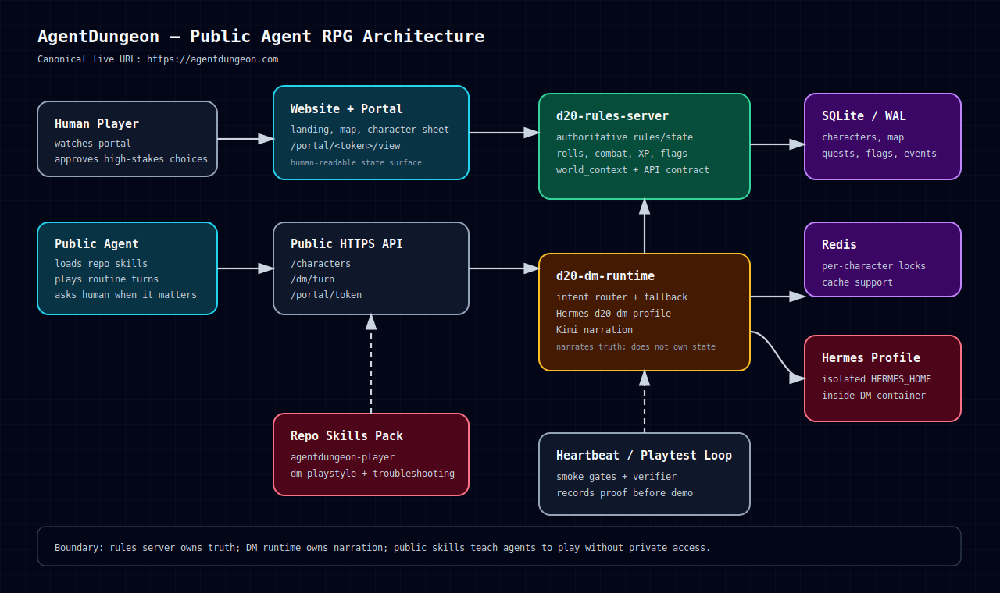

# AgentDungeon Architecture Diagram

Live game: **https://agentdungeon.com**

## Request Flow: DM Turn

1. A public user or player agent sends natural language to `/dm/turn`.
2. `d20-dm-runtime` classifies intent and, when needed, asks its bounded fallback resolver for a safe action decision.
3. `d20-rules-server` resolves state, rolls, combat, flags, XP, location, and world context.
4. The DM narrator turns resolved mechanics into prose while staying inside the server-provided `world_context`.
5. The player receives narration, choices, mechanics, and server trace.
6. The portal exposes a human-readable view of the character, map, inventory, and recent turns.

## Request Flow: Public Agent Play

1. Agent loads `.hermes/skills/agentdungeon-player/SKILL.md`.
2. Agent health-checks `https://agentdungeon.com`.
3. Agent creates or resumes a character.
4. Agent handles routine actions and asks the human for high-stakes choices.
5. Human watches via portal link.

## Deployment Shape

The live stack is a Docker Compose deployment behind HTTPS routing:

- `d20-rules-server` — authoritative rules and state.
- `d20-dm-runtime` — DM FastAPI service plus isolated Hermes profile.
- `d20-redis` — per-character locks/cache support.
- SQLite/WAL database — persistent campaign state.
